# TripAdvisor-NLP-Analysis

Dans le cadre du Master 2 Statistique & Informatique (SISE), nous avons créé une application destinée à analyser les données de plusieurs restaurants lyonnais. L’objectif de cette application est d’examiner les avis et les notes laissés par les clients sur TripAdvisor. Les informations sont extraites via du "web scraping" puis stockées dans une base de données structurée. Ces données sont ensuite soumises à une analyse complète, alliant une étude descriptive approfondie, l’application de méthodes de traitement du langage naturel (NLP) ainsi que l’utilisation d’un chatbot capable d’interroger la base de données pour fournir des réponses précises et personnalisées.

Cette application vise donc à extraire des informations clés afin de mettre en évidence des opportunités d’amélioration ainsi que des tendances majeures. Ces connaissances permettraient aux restaurants de mieux comprendre les attentes de leurs clients et d’optimiser leurs services en conséquence.

---

## **Structure du projet** :

```plaintext
TripAdvisor-NLP-Analysis/
├── client/
│   ├── interface/           # Interfaces utilisateur (frontend)
│   ├── requirements.txt     # Dépendances spécifiques au client
│   └── app.py               # Point d'entrée pour l'application utilisateur
├── documentation/           # Documentation du projet
├── notebook/                # Notebooks pour analyses exploratoires
├── packages/                # Modules Python personnalisés
├── render.yaml              # Configuration pour le déploiement
└── docker-compose.yml       # Configuration Docker pour orchestrer les services
```

---

## **Remarques importantes** :

1. L'installation peut paraître longue en raison de certaines bibliothèques utilisées dans ce projet, notamment PyTorch.
2. En utilisant notre application avec Docker, certains modules comme le scraping ou le chatbot risquent de ne pas fonctionner correctement à cause des différences entre les environnements Linux et celui de développement. Par exemple, Selenium, qui utilise un driver spécifique, peut poser des problèmes.

---

## **Installation du projet** :

### 1. **Cloner le projet**

```bash
git clone https://github.com/Linn2d/TripAdvisor-NLP-Analysis.git
```

Accéder au projet :

```bash
cd TripAdvisor-NLP-Analysis
```

### 2. **Installation avec Conda**

#### Étape 1 : Créer un environnement virtuel

```bash
conda create -n tripAdvisorNLP python=3.9
conda activate tripAdvisorNLP
```

#### Étape 2 : Installer les dépendances

```bash
pip install -r requirements.txt
```

#### Étape 3 : Lancer le client

```bash
cd client
streamlit run app.py
```

### 3. **Installation avec Docker**

#### Étape 1 : Construire et démarrer les services Docker

```bash
docker-compose up --build
```

#### Étape 2 : Accéder à l’application

- **Backend API** : [http://localhost:8000](http://localhost:8000)  
- **Interface utilisateur** : [http://localhost:8501](http://localhost:8501)

---

## **Architecture de la base de données**

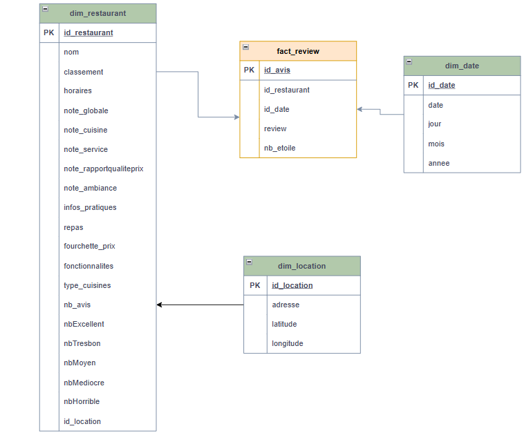


## **Architecture de l'application**

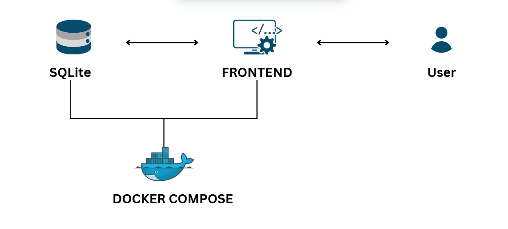

## **Présentation de quelques modules de l'application**

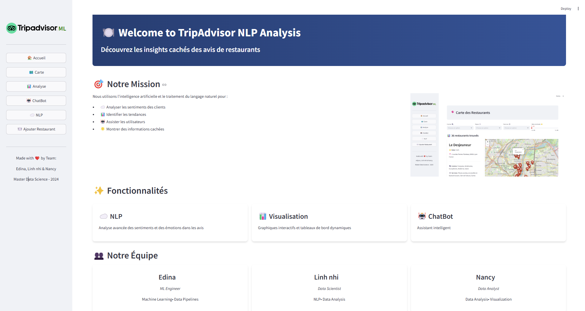

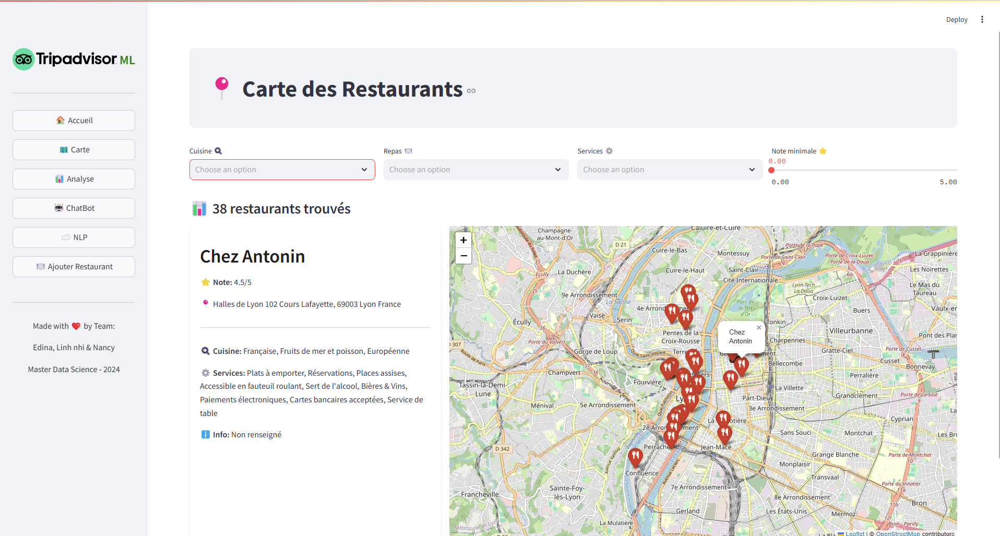

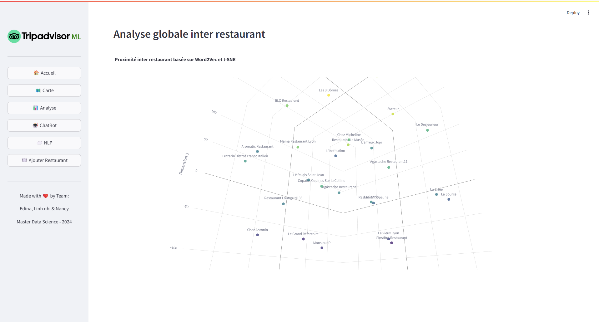
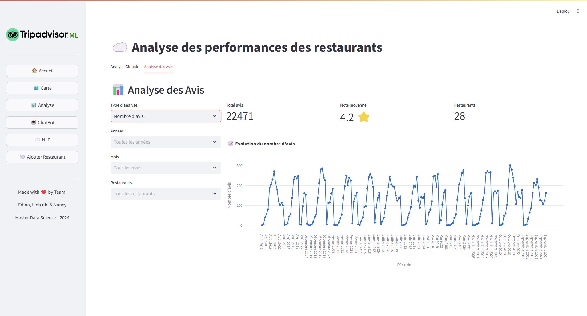
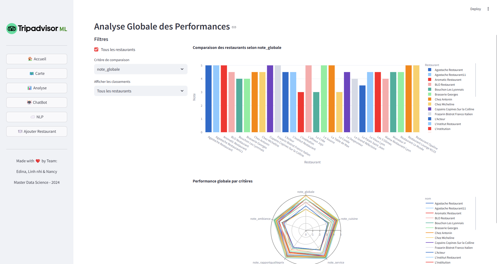


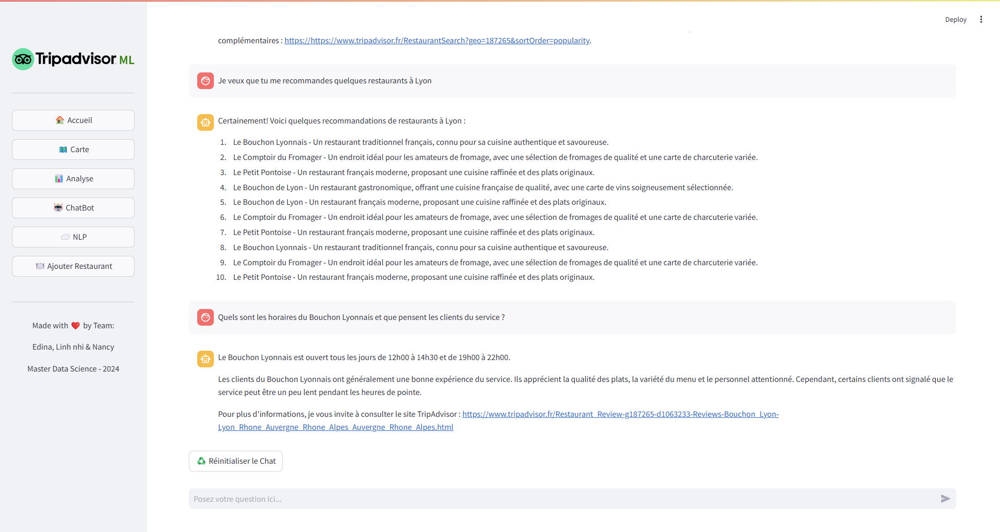

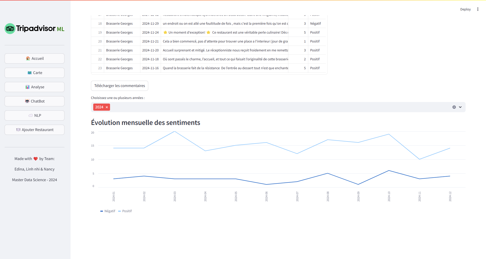
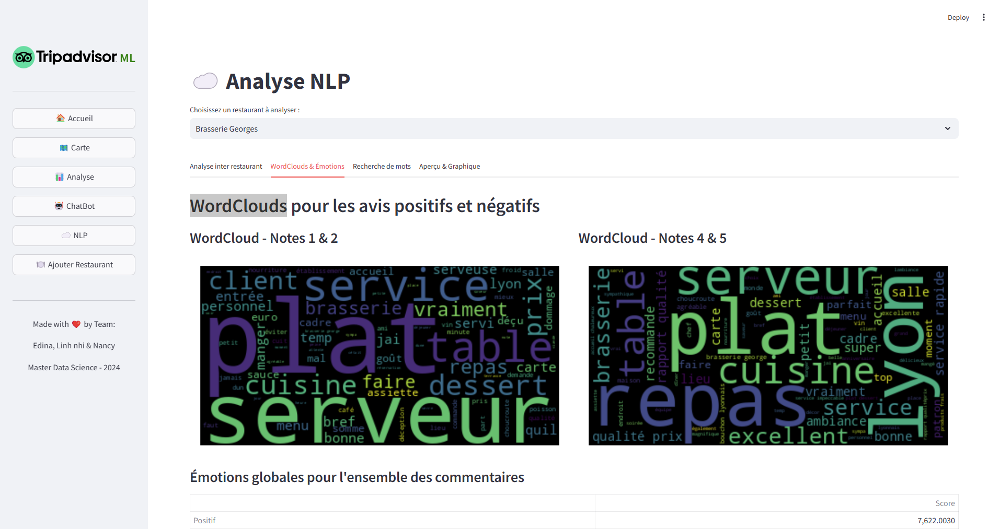

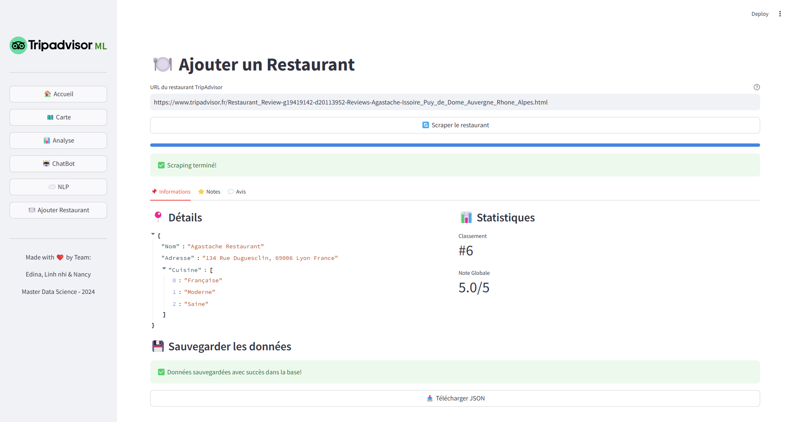 

